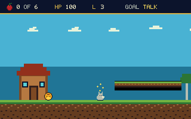

# Kolobok: Expanded Adventure

[](https://github.com/ddanila/kolobok/actions/workflows/ci.yml)



Kolobok is a 16-bit real-mode DOS platform adventure based on the Slavic
folktale. Its campaign runs from an animated cottage intro through the Garden,
Small Forest, and Deep Forest to a homecoming ending. Each level requires its
red berries and a dialogue puzzle with its guardian.

The game targets a 386DX-40, renders directly to planar 320×200×256 Mode X,
and updates at 30 Hz. It is cross-compiled on Linux or macOS with Open Watcom;
DOSBox-X only runs and verifies the completed DOS binaries.

## Playing

- Left/Right or `A`/`D`: roll
- Space or Up: jump; hold for a higher jump
- Enter: talk to a marked nearby animal
- `1`–`3`, or arrows and Enter: choose dialogue answers
- `M`: toggle detected AdLib music
- `S`: toggle PC-speaker effects
- Escape: skip the intro, or pause; Enter then resumes and Escape quits to DOS

Each level opens with a short mission card. Collect the displayed number of red
berries, find the sparkling guardian and press Enter nearby to solve its puzzle,
then reach the sparkling exit. The HUD keeps the berry count, guardian status,
and exit status visible while playing.

The title menu offers New Game, Codeword, and Quit. `REPKA` starts the Garden
without its intro, `TEREMOK` starts the Small Forest, and `MOROZKO` starts the
Deep Forest. Codeword games begin with 100 HP and three lives; sequential play
carries HP and lives between levels. `CREDITS` jumps directly to the perspective
credit crawl.

Rabbit, fox, wolf, and bear contact causes 10, 25, 40, and 50 damage. Rabbit
and fox damage cannot reduce HP below one; stronger animals can take a life.
Pits take a life immediately. Respawning restores 100 HP at the latest
checkpoint while preserving pickups and solved encounters.

Red berries open the exit. Blue berries give a refreshable ten-second speed
boost. Small pies heal and restore up to three lives only when useful. Big pies
heal, refill to three lives, or grant the fourth bonus life. Stomping an animal
freezes it for three seconds and bounces Kolobok back up, slightly lower than a
full held jump but not cuttable by releasing the jump key.

Command-line options are `-nosound`, `-nomusic`, `-selftest`, `-benchmark`, and
`-capture [intro|objective|garden|forest|deep|talk|dialogue|frozen|gameover|home|credits|creditslate]`.
`-playtest` is the deterministic target-side campaign driver used by the test
suite.

## Build and test

Install GNU Make, Bash, curl, unzip, `tar` with xz support, Python 3 with
Pillow, a C compiler, and DOSBox-X, then run:

```sh
make
make test
make dist
```

The first build installs a pinned Open Watcom toolchain under `.tools/`,
selected for the host by `tools/watcom-env.sh`. Linux x86-64 uses the published
installer; macOS arm64 and x86-64 use the same release's `ow-snapshot.tar.xz`,
because Open Watcom v2 builds macOS hosts in CI but does not publish a macOS
installer. Both paths pin the same Open Watcom release. `make test` runs host gameplay and state-machine tests, host editor-model
tests, campaign balance checks, KLV/archive JSON round-trips and CRC rejection,
a check that every level `tools/levels.py` emits passes the runtime's own
validator, the AdLib mock register sink, DOS-native game/editor and
visible-page safety self-tests, a complete deterministic three-level
playthrough, and the 7,350-cycle Deep Forest and credit-crawl performance gates.
The gates require at least 50 raw gameplay frames/s, 29.5 paced frames/s, and
30 credit-render iterations/s so music keeps its intended tempo.

`make screenshot` captures twelve deterministic DOS-native states into
`docs/captures/`, records their VRAM CRCs in `docs/captures/CRC32.txt`, and
refreshes `docs/screenshot.png`. `make dist` creates a redistributable directory
containing `KOLOBOK.EXE`, `KOLOEDIT.EXE`, `KOLOBOK.DAT`, all three KLV files,
`README.TXT`, and `LICENSE`.

Every pushed commit and pull request also runs a clean Linux-hosted Open Watcom
build in GitHub Actions. After source validation, the workflow attaches the
ready-to-run DOS bundle to the workflow run as a downloadable artifact. It does
not create or modify a GitHub Release. `make dist` creates the same bundle
locally after the full suite passes.

## Level editor

Run `KOLOEDIT.EXE LEVEL.KLV`. If no filename is supplied, it prompts for an
8.3 name; a missing file is initialized as an 80×11 level.

- Arrows move the cursor and scroll
- Tab changes Tile/Object/Marker layer
- Page Up/Down changes the selected tool
- Space paints or places; Delete erases
- Enter opens a property form for the selected object. It covers subtype,
  flags, reward/dialogue data, patrol bounds, tree type and climb association
- `1`, `2`, `3` place start, checkpoint, and exit
- F1 opens the in-editor key reference
- F2 saves atomically through `LEVEL.TMP` and keeps the file it replaced as
  `LEVEL.BAK`; F3 validates; F4 edits level theme, required-red count, and
  cloud seed
- Escape opens the save/discard/cancel confirmation

`KOLOEDIT.EXE -selftest` performs a create/edit/save/reload/delete cycle entirely
inside DOSBox-X without GUI automation.

## Data layout

`KOLOBOK.DAT` version 4 is an indexed archive containing visually distinct
`INTRO`, `GARDEN`, `FOREST`, and `DEEP` banks. The archive exceeds 64 KiB, but
every bank is checked to remain below 60 KiB. DOS allocates only the active bank
in a paragraph-aligned far-memory segment; the tile and sprite blitters consume
far sources directly instead of copying the bank into near data.

`GARDEN.KLV`, `SFOREST.KLV`, and `DFOREST.KLV` are little-endian version-4 level
files with CRC-32 protection, fixed 11-row maps, material tiles, markers,
pickups, animal patrol/climb data, trees, and encounters. Designer-owned level
JSON is under `assets/levels`; indexed tiles, sprites, the Grandpa/Grandma
animation sheet, shared palette and stable slot metadata are under `assets/art`.
The build rejects any source PNG whose palette differs from the manifest.
See [the asset workflow](assets/README.md) for sheet layouts and validation.

Convert DOS editor output back to canonical JSON with:

```sh
python3 tools/levels.py export LEVEL.KLV assets/levels/level.json
python3 tools/levels.py import assets/levels/level.json LEVEL.KLV
```

See [formats.md](docs/formats.md), [music.md](docs/music.md), and
[performance.md](docs/performance.md) for the binary contracts, music
provenance, and benchmark method.
[platform-reachability.md](docs/platform-reachability.md) covers jump height
versus platform rows, and [tracing.md](docs/tracing.md) explains the
`make dos-debug` ring-buffer log used to diagnose DOS-native failures.
`docs/art-direction.png` is the pixel-art reference the tile and sprite work
aims at. It is a target, not a capture: the shipped 320×200 renderer and its
24-pixel HUD do not match it feature for feature.

## License

Code, original graphics, and the original arrangement are MIT licensed. See
[LICENSE](LICENSE). The underlying 1861 “Korobeiniki” melody is public domain.
